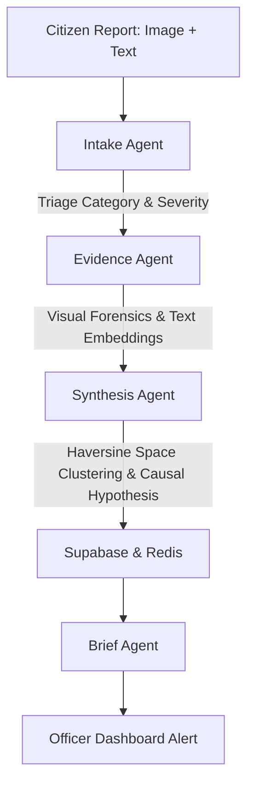

# CivicMind Multi-Agent Architecture Documentation

This document describes the design, implementation, and core logic of the agents in the **CivicMind** platform. All agent files are located in the [backend/agents](file:///Users/anshjohnson/Polaris/backend/agents) directory.

---

## Architecture Diagram

The civic reports go through a multi-stage sequential agent pipeline:



---

## 0. Type Safety Validation (`schemas.py`)

* **Path**: [schemas.py](file:///Users/anshjohnson/Polaris/backend/agents/schemas.py)
* **Purpose**: Declares Pydantic models for every agent to enforce type-safety and structured validation. This resolves issues with LLMs returning mismatched types (e.g. returning severity as a string instead of an integer).

### Models defined:
- `IntakeResponse`: Schema for report triage categorization and severity.
- `EvidenceResponse`: Schema for visual forensic observations, estimates, and confidence scores.
- `SynthesisResponse`: Schema for clustering causal reasoning, risk evaluation, and repair cost analysis.
- `BriefResponse`: Schema for subject line and body copy formatting of email briefs.

---

## 1. Intake Agent (`intake.py`)

* **Path**: [intake.py](file:///Users/anshjohnson/Polaris/backend/agents/intake.py)
* **Purpose**: Performs the initial triage of citizen-submitted reports. It classifies the category, assesses the severity, estimates the size of the affected area, and generates a one-sentence summary.
* **Model**: Uses `gemini-2.5-flash` for multi-modal analysis.

### Severity Rubric
The agent's prompts enforce a strict rubric to standardize severity assessment:
- **1** = Cosmetic issue (minor visual defect, no functional impact)
- **2** = Minor inconvenience (nuisance, but no structural or safety threat)
- **3** = Requires attention (noticeable degradation, needs monitoring/repairs soon)
- **4** = Dangerous (poses immediate structural hazard or vehicle damage risk)
- **5** = Critical public safety risk (active hazard causing immediate danger to lives or critical systems)

### Core Implementation & Validation
```python
class IntakeAgent:
    def __init__(self):
        self.model = get_gemini_model()

    async def classify_report(self, image_bytes: bytes, user_description: str = "") -> dict:
        processed_bytes, success = self._process_image(image_bytes)
        image_payload = {"mime_type": "image/jpeg", "data": processed_bytes}
        
        prompt = "..." # Includes strict severity rubric details
        
        response = await gemini_call_rate_limited(
            self.model,
            contents=[image_payload, prompt],
            generation_config={"response_mime_type": "application/json"}
        )
        parsed = IntakeResponse.model_validate_json(response.text)
        return parsed.model_dump()
```

---

## 2. Evidence Agent (`evidence.py`)

* **Path**: [evidence.py](file:///Users/anshjohnson/Polaris/backend/agents/evidence.py)
* **Purpose**: Performs forensic inspections of the imagery to find structural integrity issues, hypothesize root causes, assess risks of cascading failures, and generate text embeddings.
* **Model**: Uses `gemini-2.5-flash` and `models/text-embedding-004`.

### Confidence-Based Hypothesis Prompting
Instead of making certain factual claims (like "this pipe is 47 years old") based on a single image, the agent is instructed to state hypotheses and output a `confidence` rating (0.0 to 1.0) along with its analysis.

### Core Implementation & Validation
```python
class EvidenceAgent:
    def __init__(self):
        self.model = get_gemini_model()

    async def perform_forensics(self, image_bytes: bytes, classification_summary: str) -> dict:
        processed_bytes, success = self._process_image(image_bytes)
        image_payload = {"mime_type": "image/jpeg", "data": processed_bytes}

        prompt = "..." # Prompt detailing hypothesis guidelines and confidence scoring

        response = await gemini_call_rate_limited(
            self.model,
            contents=[image_payload, prompt],
            generation_config={"response_mime_type": "application/json"}
        )
        parsed = EvidenceResponse.model_validate_json(response.text)
        return parsed.model_dump()
```

---

## 3. Synthesis Agent (`synthesis.py`)

* **Path**: [synthesis.py](file:///Users/anshjohnson/Polaris/backend/agents/synthesis.py)
* **Purpose**: Coordinates CivicMind's urban planning intelligence. It runs a loop that uses automatic function calling to query local databases and synthesize individual reports into correlated risk clusters.
* **Model**: Uses **`gemini-2.5-pro`** for deep Urban Autopsy reasoning.

### Real Embeddings
Instead of passing a dummy `[0.0] * 768` vector, the synthesis agent binds the actual embedding vector generated by the `EvidenceAgent` (`self.current_embedding`) into the database RPC call `find_similar_issues` to enable real vector similarity matching.

### Core Implementation & Loop Logic
```python
class SynthesisAgent:
    def __init__(self):
        self.model = get_gemini_model("gemini-2.5-pro")
        self.current_embedding = None

    def query_nearby_issues(self, lat: float, lng: float, radius_meters: float = 300.0, days_back: int = 30) -> str:
        query_emb = self.current_embedding if self.current_embedding else ([0.0] * 768)
        res = supabase_client.rpc(
            "find_similar_issues",
            {
                "query_embedding": query_emb,
                "center_lat": lat,
                "center_lng": lng,
                "radius_meters": radius_meters,
                "days_back": days_back
            }
        ).execute()
        return json.dumps(res.data if res.data else [])

    async def run_synthesis(self, new_issue: dict) -> dict:
        self.current_embedding = new_issue.get("embedding")
        tools = [self.query_nearby_issues, self.fetch_infrastructure_history, self.assess_causal_chain]
        
        chat = self.model.start_chat(enable_automatic_function_calling=True)
        response = await gemini_call_rate_limited(
            chat,
            f"...Details...",
            method="send_message",
            generation_config={"response_mime_type": "application/json"}
        )
        parsed = SynthesisResponse.model_validate_json(response.text)
        return parsed.model_dump()
```

---

## 4. Brief Agent (`brief.py`)

* **Path**: [brief.py](file:///Users/anshjohnson/Polaris/backend/agents/brief.py)
* **Purpose**: Separation of concerns. While Synthesis reasons, the `BriefAgent` formats and generates clean, professional communications (alert email drafts) to dispatch to engineers.
* **Model**: Uses `gemini-2.5-flash`.

### Core Implementation & Validation
```python
class BriefAgent:
    def __init__(self):
        self.model = get_gemini_model("gemini-2.5-flash")

    async def generate_brief(self, zone_id: str, risk_level: str, causal_hypothesis: str, affected_residents: int) -> dict:
        prompt = "..." # Prompts for professional email subject and body copy
        response = await gemini_call_rate_limited(
            self.model,
            contents=prompt,
            generation_config={"response_mime_type": "application/json"}
        )
        parsed = BriefResponse.model_validate_json(response.text)
        return parsed.model_dump()
```

---

## 5. Gemini Client Utility (`gemini_client.py`)

* **Path**: [gemini_client.py](file:///Users/anshjohnson/Polaris/backend/agents/gemini_client.py)
* **Purpose**: Coordinates rate limiting, exponential backoff, caching, and serialization across the entire agent workflow.

### SHA-256 Hashing of Image Payload
The cache key generator hashes binary image bytes using SHA-256 to ensure a clean, stable key structure rather than serializing huge raw byte chunks:
```python
if "data" in item and isinstance(item["data"], bytes):
    img_hash = hashlib.sha256(item["data"]).hexdigest()
```

---

## 6. Realtime Agent Execution Timeline

WebSocket messages streamed during report intake use a structured timeline format (`HH:MM:SS [Stage] message`) showing the clear sequential pipeline:
1. `12:01:04 [Intake] Received new citizen report. Starting classification.`
2. `12:01:06 [Intake] Classified issue as Pothole (Severity: 4/5).`
3. `12:01:08 [Evidence] Running deep forensics on uploaded imagery.`
4. `12:01:10 [Evidence] Forensics complete. Hypothesis: Possible joint failure...`
5. `12:01:11 [Embeddings] Generating semantic embeddings via models/text-embedding-004.`
6. `12:01:14 [Synthesis] Invoking reasoning loop on Gemini 2.5 Pro (Urban Autopsy).`
7. `12:01:18 [Synthesis] Completed. Risk level: CRITICAL. Causal Hypothesis: ...`
